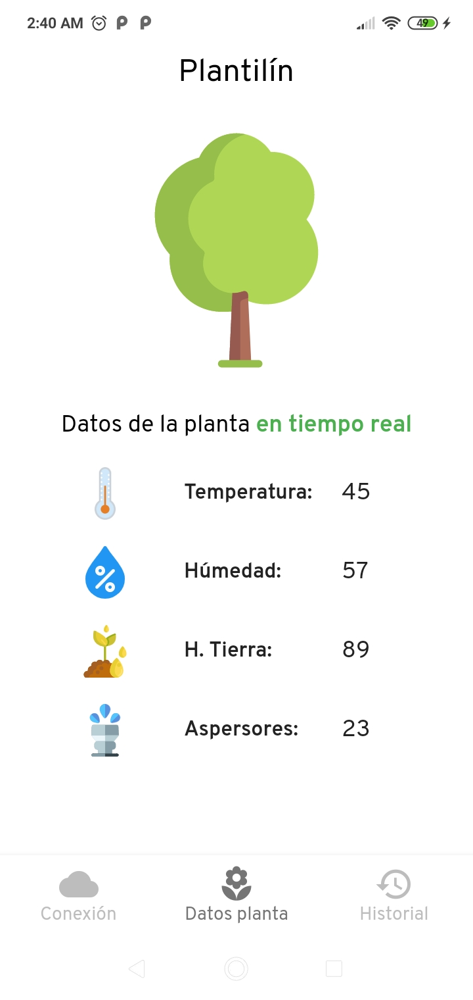

# App Plantilin

Proyecto escolar con la finalidad de monitorear una planta en cuanto a:
- Humedad
- Temperatura
- Humedad de la tierra
- Aspersores (ON/OFF)

Se utiliza el protocolo MQTT, usando la librería mqtt_client de flutter.

Algunas screenshots son las siguientes

## Pantalla inicial

## Conectado al servidor o broker

## Suscripción a un topic

## Datos de la planta

## Creado con flutter
